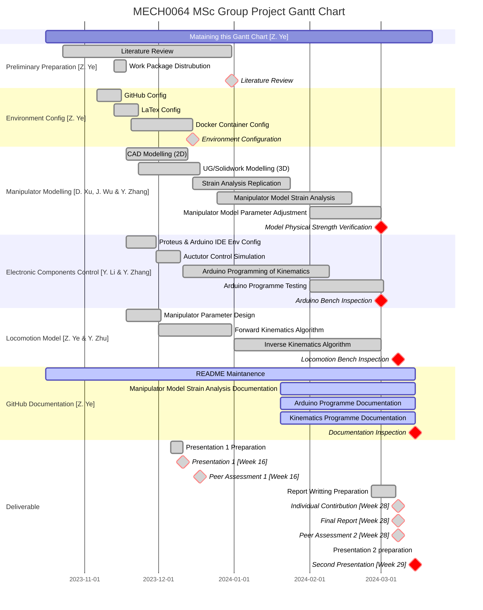

# 📋 Project Planning
This is the project planning section. The Gantt chart and Milestones about this project are listed as follow.
## Gantt Chart

## Deadlines

Deadlines of project

|Assessment elements|Assessment Type|Contribution|Due Date|
|:--|:--|:--|:--|
|Presentation 1|Formative|Team|2023-12-11|
|Peer Assessment 1|Formative|Individual|2023-12-18|
|Final Report|Summative|Team|2024-03-08|
|Peer Assessment 2|Summative|Individual|2024-03-08|
|Individual Contribution|Summative|Individual|2024-03-08|
|Presentation 2|Summative|Team|2024-03-15|

