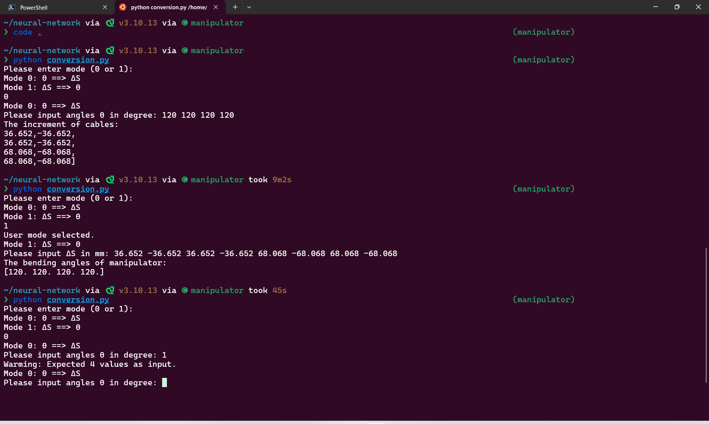
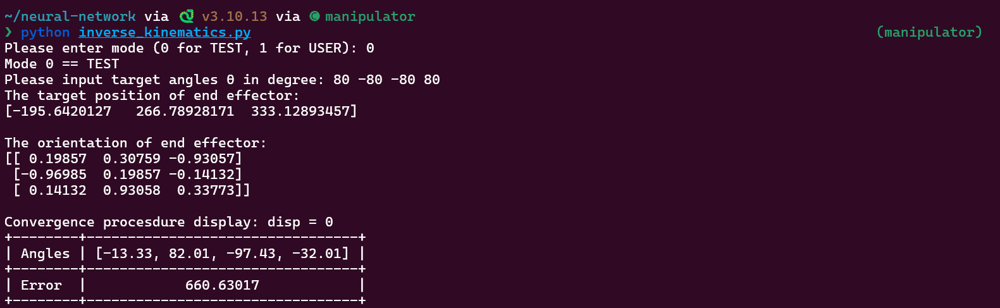
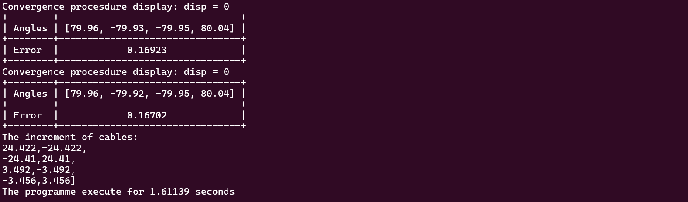
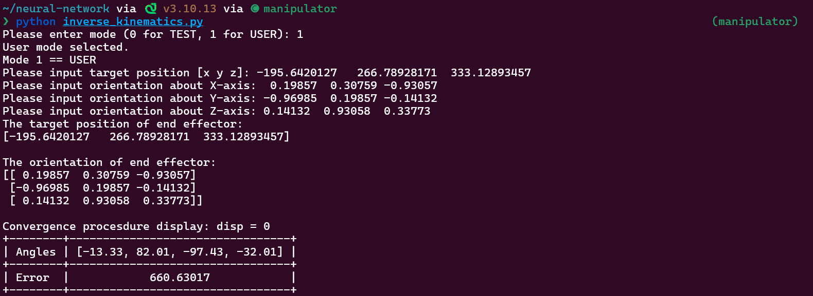
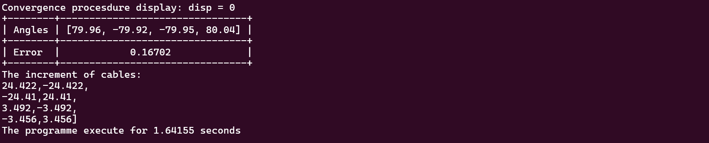

# Python Kinematics Programme Tutorial
## 🤖 Trajectory Replication Display
https://github.com/yezehao/Compact-Continuum-Manipulator-Platform/assets/96078570/2f5e6fad-2410-4b58-8dbd-b24e27642233
## 📁 Folder Description
```sh
.
├── circle
├── IK_NN
├── conversion.py
├── FABRIKc.py
├── forward-kinematics.ipynb
├── inverse_kinematics.py
├── work-space-simulation.py
├── trajectory_replication.py
└── README.md

```

## 🐍 Python Library Usage
For the programme related to forward kinematics, `Pytorch` is used because the inverse kinematics programme is designed to use ANN at the very beginning. However, after the indeed research, the ANN was found out that unsuitable for the inverse kinematics. So the inverse kinematics programme use `Numpy`, which is simple and do not require to install `Pytorch` additionally. I do apologize for any inconvenience caused by this issue.
### 
The following programmes in this folder use `Pytorch`. The virtual environment created in [installation](https://github.com/yezehao/Compact-Continuum-Manipulator-Platform/tree/main?tab=readme-ov-file#%EF%B8%8F-installation) need to be activated while using the programmes. 
```sh
├── forward-kinematics.ipynb
├── IK_NN
│   ├── inverse-kinematics_homogeneous.ipynb
│   ├── inverse-kinematics.ipynb
│   └── model
└── work-space-simulation.py
```
### 
The following programmes in this folder use `Numpy`. If there are `Numpy` and `Matplotlib` in your Python environment, you can directly use these programme.
```sh
├── conversion.py
├── FABRIKc.py
├── inverse_kinematics.py
└── trajectory_replication.py
```

## 👩‍💻 Running Tutorial
+ `conversion.py`: this is the python programme used to convert between angles of the segments and change of the cables. To run this programme, the users need to uncomment the main function start from row 53. Afterwards, the programme can be executed by command: 
```
python conversion.py
```
The program's running results are as follow. The users can select the modes about conversion. If the user enters an incorrect format, the program prompts the user to re-enter.
<p align="center">
  
</p>

+ `forward-kinematics.ipynb`: this is the juypter notebook about forward kinematics, the running tutorial is provided in the notebook.
+ `IK_NN`: this is the folder about inverse kinematics by using data-driven method using ANN. However, this approach failed at the end.
+ `work-space-simulation.py`: this is the python programme used to randomly generate the positions of manipulator end effector. By fitting these positions, the workspace of the manipulator can be acquired. The programme can be run with the following command, `<number>` represents the number of random positions you want to generate. The result of the programme would be saved in `data.json`.
    ```
    python work-space-simulation.py <number>
    ```
+ `FABRIKc.py`: this contains functions about inverse kinematics. It use the algorithn called [FABRIKc](https://ieeexplore.ieee.org/abstract/document/8452693) to make approximation about the inverse kinematics. Compared with other approximation algorithm, this is efficient without suffering from singularity problems. The programmes `inverse_kinematics.py` and `trajectory_replication.py` utilize the functions in this python code.
+ `inverse_kinematics.py`: this programme is used to get the solution about inverse kinematics. There are two modes for the inverse kinematics, which are **Test Mode** and **User Mode**. 
  + **Test Mode 0** is utilized to validate the accuracy of the programme. The target anlges $\boldsymbol{\theta}$ is used as input. The result about inverse kinematics is shown as follows.
<p align="center">
    
    
</p>
  + **User Mode 1** is utilized to apply inverse kinematics according to the position and orientation of the end effector. The $\textbf{P}_{target}$ and $\textbf{O}_{target}$ are used as input. The result about inverse kinematics is shown as follows.
<p align="center">
    
    
</p>
+ `trajectory_replication.py`: this programme is used to replicate the trajectory. The user can simply modify the angles in [alpha.txt](circle/alpha.txt). The result is shown at [🤖 Trajectory Replication Display](#-trajectory-replication-display).