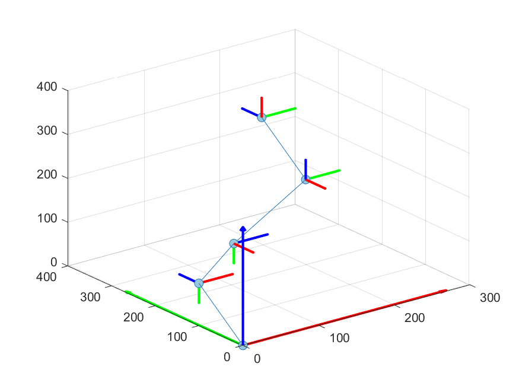
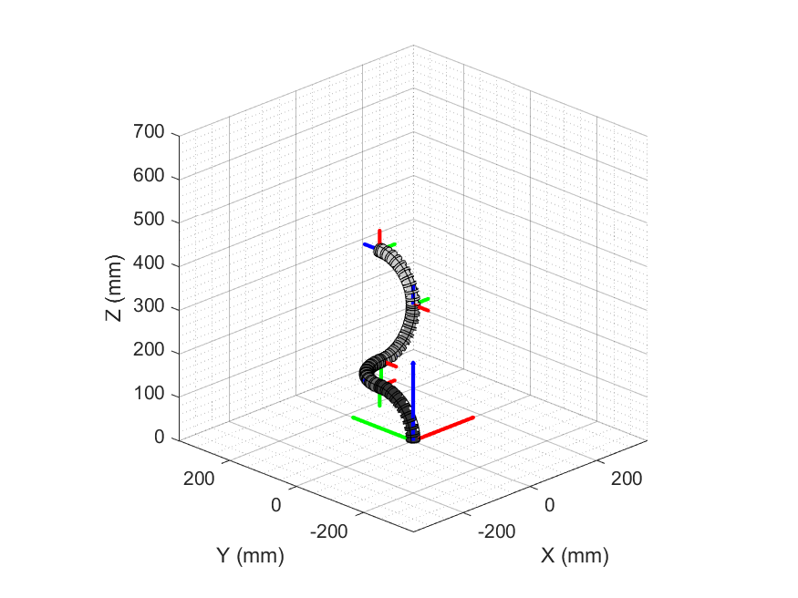

# MATLAB Kinematics Programme Tutorial 
#### 📁 Folder Description
```sh
├── /result/
├── /(UT)_dataset/
├── draw_tdcr.m
├── FK_matrix.m
├── error_calculation.m
├── FKD_geometry.m
├── FKD_visual.m
├── workspace_simulation.m
└── README.md
```

#### MATLAB function
There are two MATLAB functions in the `MATLAB` folder: `draw_tdcr.m` and `FK_matrix.m`. 
+ `draw_tdcr.m`: This is the function used to generate the visualization of forward kinematics. This function is developed by [CRVisToolkit](https://github.com/ContinuumRoboticsLab/CRVisToolkit). Details about the visualization tool are listed [here](https://www.opencontinuumrobotics.com/)
+ `FK_matrix.m`: This is the function used to calculate the forward kinematics. The parameters of manipulator are the inputs of function. The outputs of the function are the orientations and positions of the key nodes.    
#### MATLAB programme
There are four programmes in the `MATLAB` folder: `error_calculation.m`, `FKD_geometry.m`, `FKD_visual.m`, and `workspace_simulation.m`.
+ `error_calculation.m`: The approximation is made during the kinematics algorithm conduction. Hence, it is necessary to evaluate the approximation to ensure that the error is sufficiently small to be negligible. The programme performs error calculations for corresponding parameter design.

+ `FKD_geometry.m`: The programme is used to display the geometry model of the manipulator. `FKD` stand for "forward-kinematics-display". The orientations and positions of key nodes are diplayed accordingly. There is an example showing the manipulator geometry model with bending angle $alpha$, where $alpha = [90;90;-90;-90]$. The generated diagrams are saved as `result/geometry_alpha1_alpha2_alpha3_alpha4.png`.  

+ `FKD_visual.m`: The programme is used to generate the posture of the manipulator. The orientations of key nodes are diplayed accordingly. There is an example showing the posture of manipulator with bending angle $alpha$, where $alpha = [90;90;-90;-90]$. The generated diagrams are saved as `result/manipulator_alpha1_alpha2_alpha3_alpha4.png`.    
<p align="center">
  
  
</p>

+ `workspace_simulation.m`: The programme is used to identify the workspace of the manipulator. The generated workspace can be saved as the dataset for the training of inverse kinematics. The generated dataset are saved in folder `(UT)_dataset` for further training. Meanwhile, this programme also used to segment the useful cubic workspace whose side length is 300 mm. The segmented useful workspace is shown as follow.
<p align="center">
  
  
</p>
