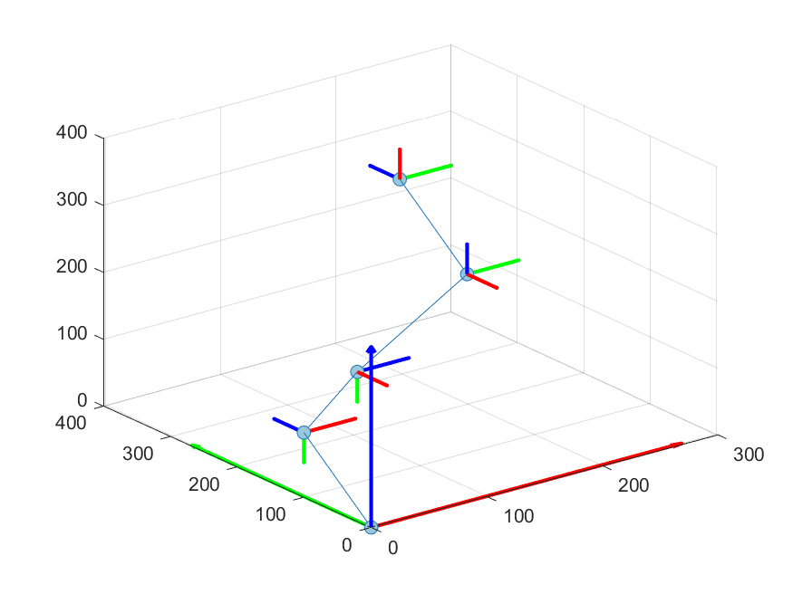
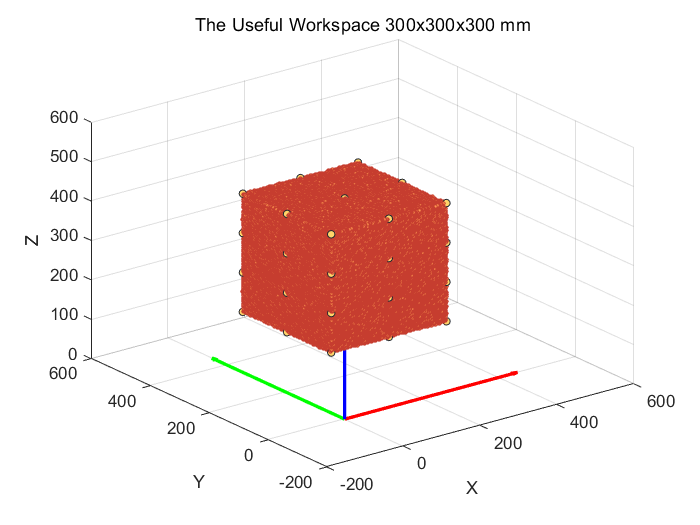

# MATLAB Kinematics Programme Tutorial 
#### 🚀 MATLAB function
There are two MATLAB functions in the `MATLAB` folder: `draw_tdcr.m` and `FK_matrix.m`. 
+ `draw_tdcr.m`: This is the function used to generate the visualization of forward kinematics. The programmes `FKD_visual.m` and `trajectory_replication_display.m` use this function. This function is developed by [CRVisToolkit](https://github.com/ContinuumRoboticsLab/CRVisToolkit). Details about the visualization tool are listed [here](https://www.opencontinuumrobotics.com/)
+ `FK_matrix.m`: This is the function used to calculate the forward kinematics. The programme `workspace_simulation.m` use this function. 
#### 🚀 MATLAB programme
There are five programmes in the `MATLAB` folder: `error_calculation.m`, `FKD_geometry.m`, `FKD_visual.m`, `trajectory_replication_display.m`, and `workspace_simulation.m`.
+ `error_calculation.m`: The approximation is made during the kinematics algorithm conduction. Hence, it is necessary to evaluate the approximation to ensure that the error is sufficiently small to be negligible. The programme performs error calculations for corresponding parameter design.

+ `FKD_geometry.m`: The programme is used to display the geometry model of the manipulator. `FKD` stand for "forward-kinematics-display". The orientations and positions of key nodes are diplayed accordingly. There is an example showing the manipulator geometry model with bending angle $alpha$, where $alpha = [90;90;-90;-90]$. The generated images are saved as `result/G_<alpha1>_<alpha2>_<alpha3>_<alpha4>.png`.  

+ `FKD_visual.m`: The programme is used to generate the posture of the manipulator. The orientations of key nodes are diplayed accordingly. There is an example showing the posture of manipulator with bending angle $alpha$, where $alpha = [90;90;-90;-90]$. The generated images are saved as `result/V_<alpha1>_<alpha2>_<alpha3>_<alpha4>.png`.    
<p align="center">
  
  
</p>

+ `trajectory_replication_display.m`: The programme is used to generate videos for trajectory replication. The input of the programme is data generated by Python programme [trajectory_replication.py](https://github.com/yezehao/Compact-Continuum-Manipulator-Platform/blob/main/Kinematics/trajectory_replication.py) and the data is saved in `/result/circle/` which is same as [/result/circle/](https://github.com/yezehao/Compact-Continuum-Manipulator-Platform/tree/main/Kinematics/circle). The index is the number of random points generated in simualtion.
<p align="center">
  
  
</p>

+ `workspace_simulation.m`: The programme is used to segment the cubic workspace of the manipulator whose side length is 300 mm. The generated images are saved as `result/CWS_<index>.png`. The index is the number of random points generated in simualtion.
<p align="center">
  
  
</p>

#### 📁 Folder Description
```sh
.
├── draw_tdcr.m
├── error_calculation.m
├── FKD_geometry.m
├── FKD_visual.m
├── FK_matrix.m
├── trajectroy_replication_display.m
├── workspace_simulation.m
├── README.md
└── result
    ├── circle
    │   ├── alpha.txt
    │   ├── circle.mp4
    │   ├── cita.txt
    │   ├── error.txt
    │   ├── target.txt
    │   └── target_.txt
    ├── CWS_10e5.png
    ├── CWS_10e8.png
    ├── G_90_90_-90_-90.png
    ├── TR_circle.png
    ├── TR_cross.png
    ├── TR_diff_init.png
    └── V_90_90_-90_-90.png


```

