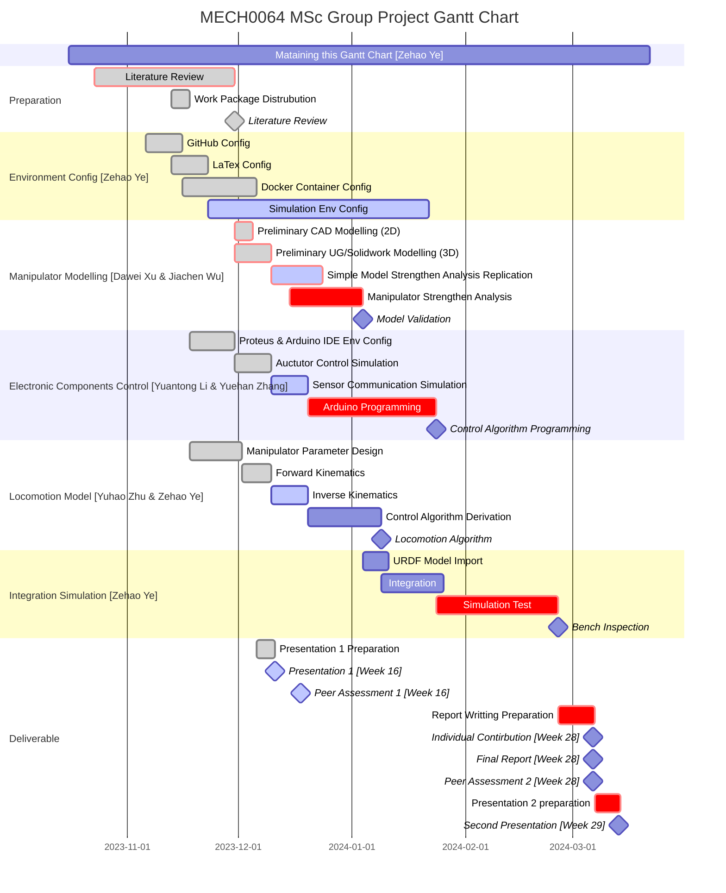
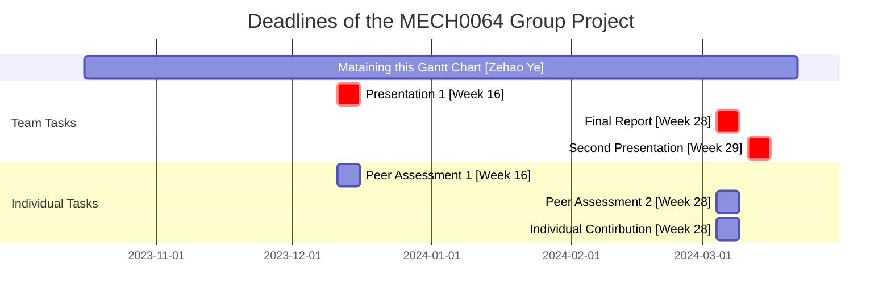

# Compact-Continuum-Manipulator-Platform
## Gantt Chart

## Milestone & Deliverable

Deadlines of project

|Assessment elements|Assessment Type|Contribution|Due Date|
|:--|:--|:--|:--|
|Presentation 1|Formative|Team|Week 16|
|Peer Assessment 1|Formative|Individual|Week 16|
|Final Report|Summative|Team|Week 28|
|Peer Assessment 2|Summative|Individual|Week 28|
|Individual Contirbution|Summative|Individual|Week 28|
|Presentation 2|Summative|Team|Week 29|

## Description
The project is proposed to develop a compact continuum robotic platform suitable for precisely manipulating ultrasonic transducers for laboratory experimental FUS studies. 

Aim

The aim of the project is to develop a compact continuum robotic platform for precise manipulation of an *ultrasonic transducer* (`cylindrical`, `dimensions of 65x30 mm`, `weight < 0.8 kg`)

Main Features

The features of the compact continuum manipulator platform are as follow:   
`compact`, `versatile`, `cost-effective`, `programmable`, `open-source`, `6-DOF`

The product is ideally consist of a *continuum robot*, a *driving system* and a *control system* developed using Arduino.

Objectives

- [ ] Identify the most suitable design of tendon manipulators for this application,
- [ ] Design and simulate the kinetics and kinematics of the platform numerically,
- [ ] Optimise the design by minimising the dimensions of the platform,
- [ ] Propose suitable instrumentation and develop the required controller,
- [ ] Open-source project repository, including the codes, simulations and CAD files.

