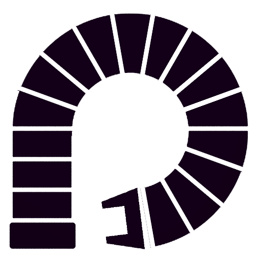
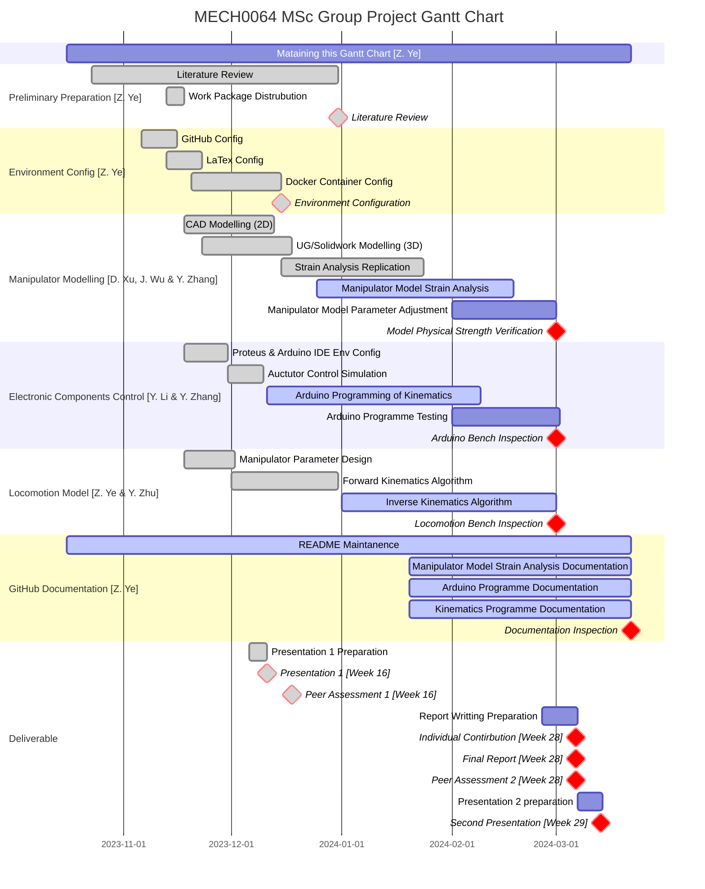
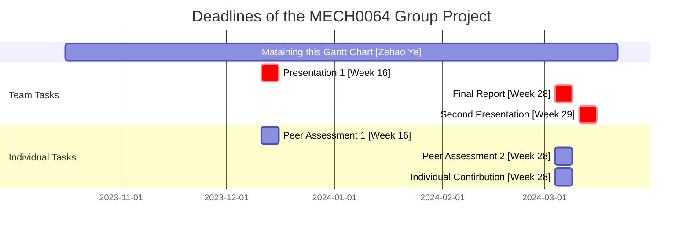

  

<h1 align="center">Compact Continuum Manipulator Platform</h1>
<h3 align="center"><i>Repository Status</i></h3>

<h3 align="center"><i>Developed with tools and softwares below.</i></h3>

	

  
  
  

## 🔗 Quick Links

> - [📍 Overview](#-overview)
> - [🔮 Project Plan](#-project-plan)
> - [🚀 Getting Started](#-getting-started)
> - [⚙️ Installation](#️-installation)
> - [👩‍💻 Running Simulation](#-running-readme-ai)
> - [🤝 Contributing](#-contributing)

## 📍 Overview

The project is proposed to develop a compact continuum robotic platform suitable for precisely manipulating ultrasonic transducers for laboratory experimental FUS studies. 

Aim

The aim of the project is to develop a compact continuum robotic platform for precise manipulation of an *ultrasonic transducer* (`cylindrical`, `dimensions of 65x30 mm`, `weight < 0.8 kg`)

Main Features

The features of the compact continuum manipulator platform are as follow:   
`compact`, `versatile`, `cost-effective`, `programmable`, `open-source`, `6-DOF`

The product is ideally consist of a *continuum robot*, a *driving system* and a *control system* developed using Arduino.

Objectives

- [ ] Identify the most suitable design of tendon manipulators for this application,
- [ ] Design and simulate the kinetics and kinematics of the platform numerically,
- [ ] Optimise the design by minimising the dimensions of the platform,
- [ ] Propose suitable instrumentation and develop the required controller,
- [ ] Open-source project repository, including the codes, simulations and CAD files.

## 🔮 Project Plan
### Gantt Chart

### Milestone & Deliverable

Deadlines of project

|Assessment elements|Assessment Type|Contribution|Due Date|
|:--|:--|:--|:--|
|Presentation 1|Formative|Team|Week 16|
|Peer Assessment 1|Formative|Individual|Week 16|
|Final Report|Summative|Team|Week 28|
|Peer Assessment 2|Summative|Individual|Week 28|
|Individual Contribution|Summative|Individual|Week 28|
|Presentation 2|Summative|Team|Week 29|
</detail>

## 🚀 Getting Started
