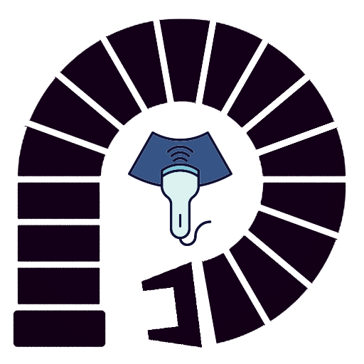
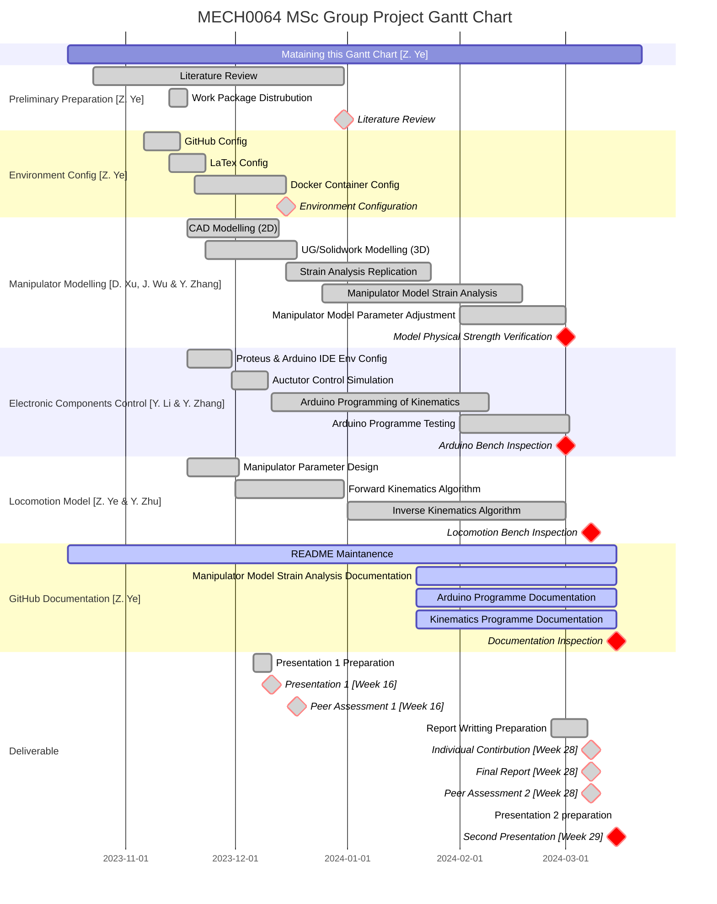

<p align="center">
  
</p>
<h1 align="center">Compact Continuum Manipulator Platform</h1>
<h3 align="center"><i>Repository Status</i></h3>
<div align="center">

[](https://hub.docker.com/layers/osrf/ros/noetic-desktop-full-focal/images/sha256-70037dab062e8edf988261a1ab937182676a984036219ebac4b8ec2ce6d1159e?context=explore)
[](https://opensource.org/licenses/MIT)


</div>
<h3 align="center"><i>Developed with tools and softwares below.</i></h3>
<div align="center">
<p align="center">
	<a href="https://skillicons.dev">
		
	</a></p>


  [](https://www.labcenter.com/)
  [](https://www.ansys.com/)
  [](https://www.solidworks.com/)

</div>


## 🔗 Quick Links

> - [📍 Overview](#-overview)
> - [🤖 Demo](#-demo)
> - [📁 Repository Structure](#-repository-structure)
> - [🔮 Project Plan](#-project-plan)
> - [🚀 Getting Started](#-getting-started)
>   - [⚙️ Installation](#️-installation)
>   - [👩‍💻 Running Tutorial](#-running-tutorial)
>   - [📋 Parameter Definations](#-parameter-definations)
> - [🤝 Contributing](#-contributing)

## 📍 Overview

The project is proposed to develop a compact continuum robotic platform suitable for precisely manipulating ultrasonic transducers for laboratory experimental FUS studies. 

<details closed>
<summary>Aim</summary>

The aim of the project is to develop a compact continuum robotic platform for precise manipulation of an *ultrasonic transducer* (`cylindrical`, `dimensions of 65x30 mm`, `weight < 0.8 kg`)

</details>


<details closed>
<summary>Main Features</summary>

The features of the compact continuum manipulator platform are as follow:   
`compact`, `versatile`, `cost-effective`, `programmable`, `open-source`, `6-DOF`

The product is ideally consists of a *continuum robot*, a *driving system* and a *control system* developed using Arduino.
</details>

<details closed>
<summary>Objectives</summary>

- [ ] Identify the most suitable design of tendon manipulators for this application,
- [ ] Design and simulate the kinetics and kinematics of the platform numerically,
- [ ] Optimise the design by minimising the dimensions of the platform,
- [ ] Propose suitable instrumentation and develop the required controller,
- [ ] Open-source project repository, including the codes, simulations and CAD files.

</details>

## 🤖 Demo
Trajectory Replication Display  

https://github.com/yezehao/Compact-Continuum-Manipulator-Platform/assets/96078570/2f5e6fad-2410-4b58-8dbd-b24e27642233

## 📁 Repository Structure
```sh
📦 Compact Continuum Manipulator Platform
├── 📂 .devcontainer
├── 📂 Arduino-Simulation
│   ├── 📂 motor_control_final
│   │   └── motor_control_final.ino
│   ├── multiple_motor_control.ino
│   ├── multiple_motor_control.pdsprj
│   └── 📜 README.md
├── 📂 Deliverable
│   ├── 📂 Documentation
│   └── 📂 Final-Report
│       ├── 📂 Appendix
│       ├── 📂 config
│       ├── 📂 Image
│       ├── 📂 Section
│       ├── Main-Thesis-File.pdf
│       ├── Main-Thesis-File.tex
│       └── references.bib
├── 📂 Kinematics
│   ├── 📂 circle
│   ├── 📂 IK_NN
│   ├── conversion.py
│   ├── FABRIKc.py
│   ├── forward-kinematics.ipynb
│   ├── inverse_kinematics.py
│   ├── trajectory_replication.py
│   ├── work-space-simulation.py
│   └── 📜 README.md
├── 📂 MATLAB
│   ├── 📂 result
│   ├── draw_tdcr.m
│   ├── error_calculation.m
│   ├── FKD_geometry.m
│   ├── FKD_visual.m
│   ├── FK_matrix.m
│   ├── TR_display.m
│   ├── workspace_simulation.m
│   └── 📜 README.md
├── 📂 Model
│   └── Manipulator.SLDASM
├── 📄 LICENSE
├── 📋 requirements.txt
└── 📜 README.md
```


## 🔮 Project Plan
### Gantt Chart


<details closed>
<summary>Deadlines of project</summary>

|Assessment elements|Assessment Type|Contribution|Due Date|
|:--|:--|:--|:--|
|Presentation 1|Formative|Team|2023-12-11|
|Peer Assessment 1|Formative|Individual|2023-12-18|
|Final Report|Summative|Team|2024-03-08|
|Peer Assessment 2|Summative|Individual|2024-03-08|
|Individual Contribution|Summative|Individual|2024-03-08|
|Presentation 2|Summative|Team|2024-03-15|

</details>

## 🚀 Getting Started
**Requirements for Kinematics Simulation**
+ Python: 3.10+
+ Package manager or container runtime: `conda`, `pip` or `docker` recommended.

### ⚙️ Installation
#### Kinematics Simulation Programme
**`Conda` Installation**  
 *RECOMMAND*    
+ Create conda environment and activation:
  ```
  conda create -n manipulator python=3.10  
  ```
  ```
  conda activate manipulator 
  ```
+ Install pytorch according to [Pytorch Official Turorial](https://pytorch.org/): 
  ```  
  conda install pytorch torchvision torchaudio pytorch-cuda=<your_version> -c pytorch -c nvidia   
  ```
+ Other Installation
  ```
  conda install jupyter notebook
  conda install ipykernel
  ```
  ```  
  pip install -r requirements.txt
  ```

**`Pip` Installation**  
   
+ Create virtual environment (optional)
  ```
  python -m venv venv
  venv\Scripts\activate
  ```
+ Install pytorch according to [Pytorch Official Turorial](https://pytorch.org/)
  ```  
  pip3 install torch torchvision torchaudio --index-url https://download.pytorch.org/whl/cu<your-version>   
  ```
+ Other Installation
  ```  
  pip install jupyter notebook
  pip install ipykernel
  pip install pandas
  pip install h5py
  pip install matplotlib
  ```


### 👩‍💻 Running Tutorial
#### Kinematics Simulation Programme
There are two versions of the kinematics about compact continuum manipulator platform. The python version (2.0) have robust performances in Machine Learning (ML) compared with the MATLAB version (1.0). The simulation about inverse kinematics will mainly contribute to the python programme to make further explanation. However, the MATLAB version (1.0) have better visualization, which can be utilized for parameter design and manipulator model displayment. The tutorials about the kinematics programmes are shown as follow: 
+ [MATLAB Version (1.0)](MATLAB/README.md) 
+ [Python Version (2.0)](Kinematics/README.md)

#### Further Improvement
The CAD model of the manipulator is designed in [Model](Modle). It can be exported into the ROS for further simulation. The docker env has been configurated in [.devcontainer](.devcontainer) and can be executed through VS Code.

### 📋 Parameter Definations
<details open>
<summary>Parameter Definations of Manipulator</summary>

|Parameter|Definition|Value (mm)|
|:--|:--|:--|
| $Sr_i$ | the length of elastic sheet in Module i | $Sr_{1,2,3,4} = 150$ |
| $d_i$ | the thickness of the cross-shaped connector | $d_{1,2,3,4,5} = 15$ |
| $N$ | the number of cross-shaped sheet in a module | $N = 0 \text{ textasciitilde} 15$ |
| $r_i$ | the distance between the centroid of connector and cable routing hole | $r_{1,2} = 17.5$, $r_{3,4} = 15$ |
| $\Delta S_i$ | the change volume of cable, cable$_{2i-1}$ and cable $_{2i}$ corresponds to Module i | |
| $\boldsymbol{\Delta S}$ | a series of change volume of cables | $\Delta S_1 \sim \Delta S_8$ |
| $\alpha_i$ | the bending angle of module i | |
| $\boldsymbol{\alpha}$ | a series of bending angles about four modules | $[\alpha_1,\ \alpha_2,\ \alpha_3,\ \alpha_4]$ |
| $\boldsymbol{\theta}$ | a series of inverse kinematics solutions | $[\theta_1,\ \theta_2,\ \theta_3,\ \theta_4]$ |
| $\boldsymbol{\epsilon}$ | threshold of the error in FABRIKc algorithm | $\boldsymbol{\epsilon} = 0.02$ |


</details>
